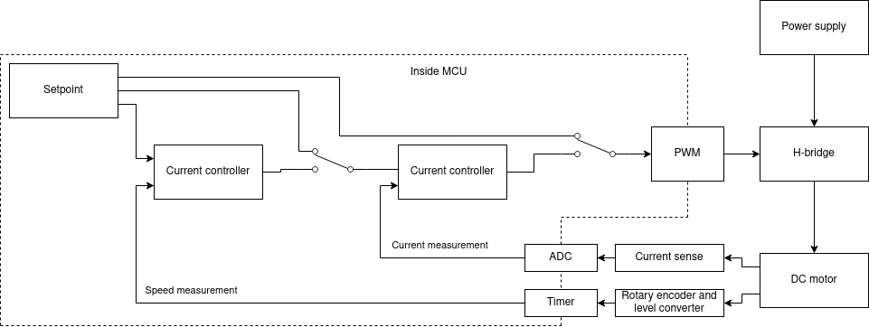

# STM32 based H-Bridge controller <!-- omit in toc -->

## Table of Contents

- [Table of Contents](#table-of-contents)
- [Description](#description)
- [Repositories](#repositories)
- [Things done for now](#things-done-for-now)
- [To do's](#to-dos)
  - [Software](#software)
  - [Hardware](#hardware)
- [Additional informations](#additional-informations)
- [Links, references, etc.](#links-references-etc)
- [Dependencies](#dependencies)
- [Notes](#notes)

## Description

Initially, the project was developed as part of my engineering thesis. It
includes PCB design and software development for controlling DC brushed motor.
The overall control system is shown at the picture below.

## Repositories
* [Software in STM32 CubeIDE](https://github.com/magiczny-kacper/STM32-H-Bridge)

## Things done for now

* Open loop control,
* Closed loop current control,
* Closed loop cascade current and speed control
* Setpoint from analog input (potentiometer)
* Ramp for speed change

## To do's

### Software

- [ ] Selectable setpoint source
- [ ] Communication protocol - maybe some CAN protocl e.g. CANOpen, or Modbus
RTU/TCP, or something other
- [ ] Some user interface - buttons, leds, display, for setting and displaying data
- [ ] Position control loop
- [ ] Extract PID library as separate library as submodule
### Hardware

- [ ] Add RC filter on current sensing signal
- [ ] Add level converters and terminal block for signals and power supply for
rotary encoder

## Additional informations

## Links, references, etc.

## Dependencies

## Notes